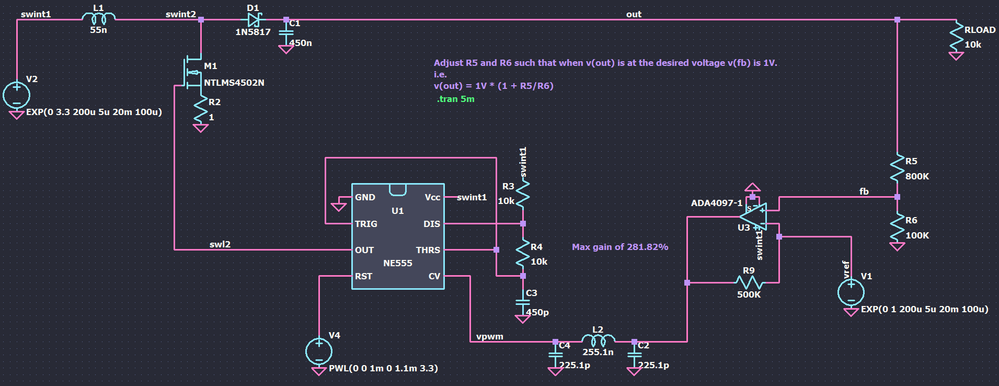
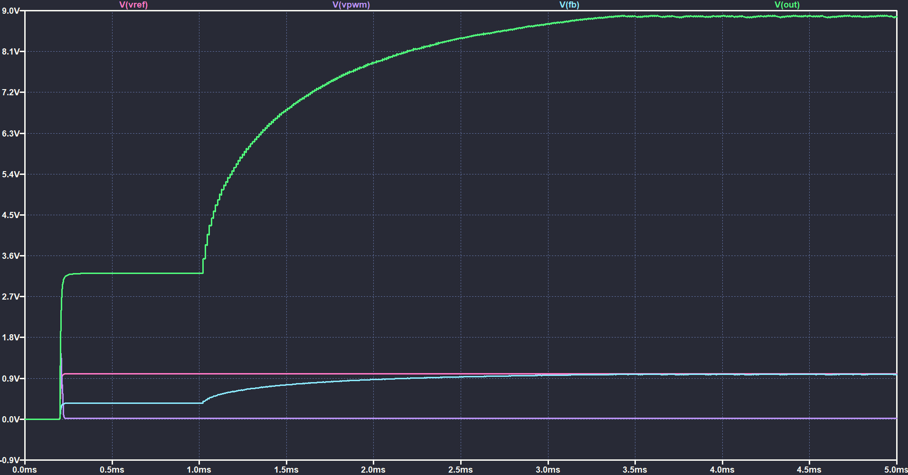

# Switched inductor booster
This repository contains an example circuit to demonstrate a Switched inductor boosting regulator.

The given example circuit helps gives insight to how a boost convertor works!

## Circuit schematic

## Circuit simulation

